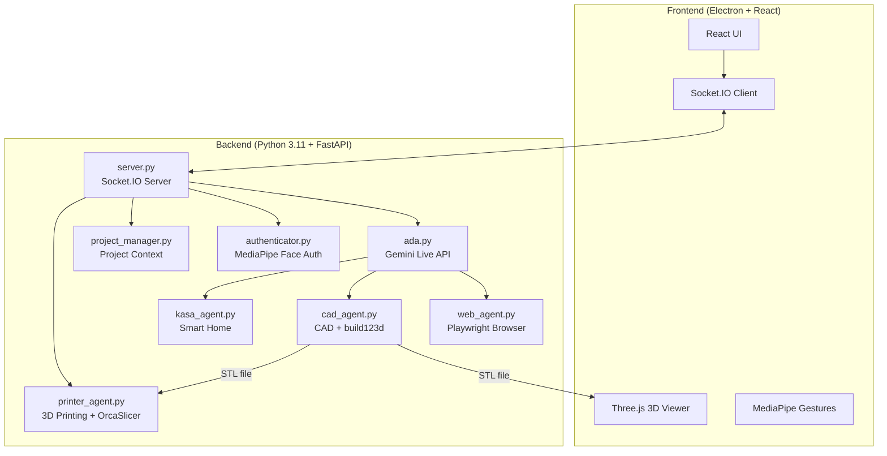

# Enki AI — Ultimate ADA Edition


 

> **Enki AI** — Ultimate ADA Edition. The ADA (Advanced Design Assistant) capability is now fully integrated into the Enki AI platform.

Enki AI Ultimate ADA Edition is a sophisticated AI assistant designed for multimodal interaction. It combines Google's Gemini 2.5 Native Audio with computer vision, gesture control, and 3D CAD generation in an Electron desktop application.

---

## 🌟 Capabilities at a Glance

| Feature | Description | Technology |
|---------|-------------|------------|
| **🗣️ Low-Latency Voice** | Real-time conversation with interrupt handling | Gemini 2.5 Native Audio |
| **🧊 Parametric CAD** | Editable 3D model generation from voice prompts | `build123d` → STL |
| **🖨️ 3D Printing** | Slicing and wireless print job submission | OrcaSlicer + Moonraker/OctoPrint |
| **🖐️ Minority Report UI** | Gesture-controlled window manipulation | MediaPipe Hand Tracking |
| **👁️ Face Authentication** | Secure local biometric login | MediaPipe Face Landmarker |
| **🌐 Web Agent** | Autonomous browser automation | Playwright + Chromium |
| **🏠 Smart Home** | Voice control for TP-Link Kasa devices | `python-kasa` |
| **📁 Project Memory** | Persistent context across sessions | File-based JSON storage |

### 🖐️ Gesture Control Details

Enki AI's "Minority Report" interface uses your webcam to detect hand gestures:

| Gesture | Action |
|---------|--------|
| 🤏 **Pinch** | Confirm action / click |
| ✋ **Open Palm** | Release the window |
| ✊ **Close Fist** | "Select" and grab a UI window to drag it |

> **Tip**: Enable the video feed window to see the hand tracking overlay.

---

## 🏗️ Architecture Overview



---

## ⚡ TL;DR Quick Start (Experienced Developers)

<details>
<summary>Click to expand quick setup commands</summary>

```bash
# 1. Clone and enter
git clone https://github.com/Cassai2026/Enki-AI.git && cd Enki-AI

# 2. Create Python environment (Python 3.11)
conda create -n enki-ai python=3.11 -y && conda activate enki-ai
brew install portaudio  # macOS only (for PyAudio)
pip install -r requirements.txt
playwright install chromium

# 3. Setup frontend
npm install

# 4. Create .env file
echo "GEMINI_API_KEY=your_key_here" > .env

# 5. Run!
conda activate enki-ai && npm run dev
```

</details>

---

## 🛠️ Installation Requirements

### 🆕 Absolute Beginner Setup (Start Here)
If you have never coded before, follow these steps first!

**Step 1: Install Visual Studio Code (The Editor)**
- Download and install [VS Code](https://code.visualstudio.com/). This is where you will write code and run commands.

**Step 2: Install Anaconda (The Manager)**
- Download [Miniconda](https://docs.conda.io/en/latest/miniconda.html) (a lightweight version of Anaconda).
- This tool allows us to create isolated "playgrounds" (environments) for our code so different projects don't break each other.
- **Windows Users**: During install, check "Add Anaconda to my PATH environment variable" (even if it says not recommended, it makes things easier for beginners).

**Step 3: Install Git (The Downloader)**
- **Windows**: Download [Git for Windows](https://git-scm.com/download/win).
- **Mac**: Open the "Terminal" app (Cmd+Space, type Terminal) and type `git`. If not installed, it will ask to install developer tools—say yes.

**Step 4: Get the Code**
1. Open your terminal (or Command Prompt on Windows).
2. Type this command and hit Enter:
   ```bash
   git clone https://github.com/Cassai2026/Enki-AI.git
   ```
3. This creates a folder named `Enki-AI`.

**Step 5: Open in VS Code**
1. Open VS Code.
2. Go to **File > Open Folder**.
3. Select the `Enki-AI` folder you just downloaded.
4. Open the internal terminal: Press `Ctrl + ~` (tilde) or go to **Terminal > New Terminal**.

---

### ⚠️ Technical Prerequisites
Once you have the basics above, continue here.

### 1. System Dependencies

**MacOS:**
```bash
# Audio Input/Output support (PyAudio)
brew install portaudio
```

**Windows:**
- No additional system dependencies required!

### 2. Python Environment
Create a single Python 3.11 environment:

```bash
conda create -n enki-ai python=3.11
conda activate enki-ai

# Install all dependencies
pip install -r requirements.txt

# Install Playwright browsers
playwright install chromium
```

### 3. Frontend Setup
Requires **Node.js 18+** and **npm**. Download from [nodejs.org](https://nodejs.org/) if not installed.

```bash
# Verify Node is installed
node --version  # Should show v18.x or higher

# Install frontend dependencies
npm install
```

### 4. 🔐 Face Authentication Setup

Enki AI now supports **multi-user registry-based face authentication**.  The system
verifies the live camera feed (the *Animus pulse*) against every enrolled user in the
`auth/registry/` directory.

**Enrol a user:**
1. Take a clear, front-facing photo of the user.
2. Name the file `<username>.jpg` (e.g. `naz.jpg`, `admin.jpg`).
3. Drop the file into `Enki-AI/auth/registry/`.
4. Restart the backend — the authenticator will automatically load all images.

**Multi-user behaviour:** If any enrolled face matches the live camera feed, access is
granted.  You can enrol as many users as needed.

**Backwards compatibility:** A single `reference.jpg` placed in
`enki_ai/agents/` is still accepted as a legacy one-entry registry.

(Optional) Toggle the feature via `settings.json` → `"face_auth_enabled": true/false`.

---

## ⚙️ Configuration (`settings.json`)

The system creates a `settings.json` file on first run. You can modify this to change behavior:

| Key | Type | Description |
| :--- | :--- | :--- |
| `face_auth_enabled` | `bool` | If `true`, blocks all AI interaction until your face is recognized via the camera. |
| `tool_permissions` | `obj` | Controls manual approval for specific tools. |
| `tool_permissions.generate_cad` | `bool` | If `true`, requires you to click "Confirm" on the UI before generating CAD. |
| `tool_permissions.run_web_agent` | `bool` | If `true`, requires confirmation before opening the browser agent. |
| `tool_permissions.write_file` | `bool` | **Critical**: Requires confirmation before the AI writes code/files to disk. |

---

### 5. 🖨️ 3D Printer Setup
Enki AI can slice STL files and send them directly to your 3D printer.

**Supported Hardware:**
- **Klipper/Moonraker** (Creality K1, Voron, etc.)
- **OctoPrint** instances
- **PrusaLink** (Experimental)

**Step 1: Install Slicer**
Enki AI uses **OrcaSlicer** (recommended) or PrusaSlicer to generate G-code.
1. Download and install [OrcaSlicer](https://github.com/SoftFever/OrcaSlicer).
2. Run it once to ensure profiles are created.
3. Enki AI automatically detects the installation path.

**Step 2: Connect Printer**
1. Ensure your printer and computer are on the **same Wi-Fi network**.
2. Open the **Printer Window** in Enki AI (Cube icon).
3. Enki AI automatically scans for printers using mDNS.
4. **Manual Connection**: If your printer isn't found, use the "Add Printer" button and enter the IP address (e.g., `192.168.1.50`).

---

### 6. 🔑 Gemini API Key Setup
Enki AI uses Google's Gemini API for voice and intelligence. You need a free API key.

1. Go to [Google AI Studio](https://aistudio.google.com/app/apikey).
2. Sign in with your Google account.
3. Click **"Create API Key"** and copy the generated key.
4. Create a file named `.env` in the `Enki-AI` folder (same level as `README.md`).
5. Add this line to the file:
   ```
   GEMINI_API_KEY=your_api_key_here
   ```
6. Replace `your_api_key_here` with the key you copied.

> **Note**: Keep this key private! Never commit your `.env` file to Git.

---

## 🚀 Running Enki AI

You have two options to run the app. Ensure your `enki-ai` environment is active!

### Option 1: The "Easy" Way (Single Terminal)
The app is smart enough to start the backend for you.
1. Open your terminal in the `Enki-AI` folder.
2. Activate your environment: `conda activate enki-ai`
3. Run:
   ```bash
   npm run dev
   ```
4. The backend will start automatically in the background.

### Option 2: The "Developer" Way (Two Terminals)
Use this if you want to see the Python logs (recommended for debugging).

**Terminal 1 (Backend):**
```bash
conda activate enki-ai
python -m enki_ai.agents.server
```

**Terminal 2 (Frontend):**
```bash
# Environment doesn't matter here, but keep it simple
npm run dev
```

---

## ✅ First Flight Checklist (Things to Test)

1. **Voice Check**: Say "Hello Enki". She should respond.
2. **Vision Check**: Look at the camera. If Face Auth is on, the lock screen should unlock.
3. **CAD Check**: Open the CAD window and say "Create a cube". Watch the logs.
4. **Web Check**: Open the Browser window and say "Go to Google".
5. **Smart Home**: If you have Kasa devices, say "Turn on the lights".

---

## ▶️ Commands & Tools Reference

### 🗣️ Voice Commands
- "Switch project to [Name]"
- "Create a new project called [Name]"
- "Turn on the [Room] light"
- "Make the light [Color]"
- "Pause audio" / "Stop audio"

### 🧊 3D CAD
- **Prompt**: "Create a 3D model of a hex bolt."
- **Iterate**: "Make the head thinner." (Requires previous context)
- **Files**: Saves to `projects/[ProjectName]/output.stl`.

### 🌐 Web Agent
- **Prompt**: "Go to Amazon and find a USB-C cable under $10."
- **Note**: The agent will auto-scroll, click, and type. Do not interfere with the browser window while it runs.

### 🖨️ Printing & Slicing
- **Auto-Discovery**: Enki AI automatically finds printers on your network.
- **Slicing**: Click "Slice & Print" on any generated 3D model.
- **Profiles**: Enki AI intelligently selects the correct OrcaSlicer profile based on your printer's name (e.g., "Creality K1").

---

## ❓ Troubleshooting FAQ

### Camera not working / Permission denied (Mac)
**Symptoms**: Error about camera access, or video feed shows black.

**Solution**:
1. Go to **System Preferences > Privacy & Security > Camera**.
2. Ensure your terminal app (e.g., Terminal, iTerm, VS Code) has camera access enabled.
3. Restart the app after granting permission.

---

### `GEMINI_API_KEY` not found / Authentication Error
**Symptoms**: Backend crashes on startup with "API key not found".

**Solution**:
1. Make sure your `.env` file is in the root `Enki-AI` folder (not inside `enki_ai/agents/`).
2. Verify the format is exactly: `GEMINI_API_KEY=your_key` (no quotes, no spaces).
3. Restart the backend after editing the file.

---

### WebSocket connection errors (1011)
**Symptoms**: `websockets.exceptions.ConnectionClosedError: 1011 (internal error)`.

**Solution**:
This is a server-side issue from the Gemini API. Simply reconnect by clicking the connect button or saying "Hello Ada" again. If it persists, check your internet connection or try again later.

---

## 📸 What It Looks Like

### 🎬 Demo Videos

> Demo recordings will be added to [`demo/`](demo/).
> Place `.mp4` or `.webm` files there — they will appear here once uploaded.

| Demo | Description |
|------|-------------|
| `demo/voice_cad.mp4` | Voice-to-CAD: speak a shape, watch it render in 3D |
| `demo/face_auth.mp4` | Face authentication via registry-based Animus pulse |
| `demo/gesture_hud.mp4` | Minority Report gesture HUD and pinch-to-query |
| `demo/sovereign_fallback.mp4` | Sovereign Fallback mode under API outage |

### 📷 Screenshots

> Screenshots will be added to [`screenshots/`](screenshots/).

| Screenshot | Description |
|------------|-------------|
| `screenshots/main_ui.png` | Main Electron window with 3D CAD viewer |
| `screenshots/auth_screen.png` | Face authentication lock screen |
| `screenshots/gesture_overlay.png` | MediaPipe hand-tracking overlay |
| `screenshots/mobile_hud.png` | Eternius 4D mobile HUD (AR overlay) |

---

## 🔬 Active Research Nodes

The following directories are **active research branches** of the Eternius 4D environment.
They are under active development and not yet part of the production bundle.

### 📱 [`/mobile`](mobile/) — Eternius 4D Mobile Layer

A React Native application (Expo) that extends the Enki AI kernel to handheld devices.

| Component | Status |
|-----------|--------|
| AR holographic HUD | In research |
| Gemini Live audio relay | In research |
| WebRTC audio streaming to desktop Node | In research |

### 🎮 [`/game_engine`](game_engine/) — Eternius 4D Game Engine

A Python-based spatial / simulation layer that models the Eternius 4D environment.

| Module | Purpose |
|--------|---------|
| `biodome_engine.py` | Procedural biome simulation |
| `elemental_engine.py` | Elemental physics layer |
| `evolution_engine.py` | Adaptive agent evolution |
| `frequency_shield.py` | Frequency-based defence mesh |
| `gesture_bridge.py` | Cross-platform gesture event bridge |
| `inventory_system.py` | Persistent item/artefact registry |
| `mission_control.py` | Mission orchestration & goal tracking |
| `offshore_engine.py` | Off-chain data anchoring stub |
| `quest_viewer.py` | Quest display & progress renderer |
| `roi_engine.py` | Region-of-interest spatial indexer |
| `vanguard_deployment.py` | Multi-agent deployment scheduler |
| `webrtc_mesh.py` | Peer-to-peer WebRTC mesh fabric |

---

## 📂 Project Structure

```
Enki-AI/
├── enki_ai/                    # Python package
│   ├── agents/                 # Real-time AI agents & server
│   │   ├── ada.py              # Gemini Live API integration
│   │   ├── server.py           # FastAPI + Socket.IO server
│   │   ├── cad_agent.py        # CAD generation orchestrator
│   │   ├── printer_agent.py    # 3D printer discovery & slicing
│   │   ├── web_agent.py        # Playwright browser automation
│   │   ├── kasa_agent.py       # TP-Link smart home control
│   │   ├── authenticator.py    # MediaPipe face auth logic
│   │   ├── project_manager.py  # Project context management
│   │   ├── tools.py            # Tool definitions for Gemini
│   │   └── reference.jpg       # Your face photo (add this!)
│   ├── api/                    # Flask REST API & database
│   ├── core/                   # Config, governance, core logic
│   ├── gui/                    # Desktop GUI
│   └── scrapers/               # Web scrapers
├── src/                        # React frontend
│   ├── App.jsx                 # Main application component
│   ├── components/             # UI components (11 files)
│   └── index.css               # Global styles
├── electron/                   # Electron main process
│   └── main.js                 # Window & IPC setup
├── projects/                   # User project data (auto-created)
├── .env                        # API keys (create this!)
├── requirements.txt            # Python dependencies
├── package.json                # Node.js dependencies
└── README.md                   # You are here!
```

---

## ⚠️ Known Limitations

| Limitation | Details |
|------------|---------|
| **macOS & Windows** | Tested on macOS 14+ and Windows 10/11. Linux is untested. |
| **Camera Required** | Face auth and gesture control need a working webcam. |
| **Gemini API Quota** | Free tier has rate limits; heavy CAD iteration may hit limits. |
| **Network Dependency** | Requires internet for Gemini API (no offline mode). |
| **Multi-User Auth** | Face auth supports multiple enrolled users via `auth/registry/`. |

---

## 🤝 Contributing

Contributions are welcome! Here's how:

1. **Fork** the repository.
2. **Create a branch**: `git checkout -b feature/amazing-feature`
3. **Commit** your changes: `git commit -m 'Add amazing feature'`
4. **Push** to the branch: `git push origin feature/amazing-feature`
5. **Open a Pull Request** with a clear description.

### Development Tips

- Run the backend separately (`python -m enki_ai.agents.server`) to see Python logs.
- Use `npm run dev` without Electron during frontend development (faster reload).
- The `projects/` folder contains user data—don't commit it to Git.

---

## 🔒 Security Considerations

| Aspect | Implementation |
|--------|----------------|
| **API Keys** | Stored in `.env`, never committed to Git. |
| **Face Data** | Processed locally, never uploaded. |
| **Tool Confirmations** | Write/CAD/Web actions can require user approval. |
| **No Cloud Storage** | All project data stays on your machine. |

> [!WARNING]
> Never share your `.env` file or `reference.jpg`. These contain sensitive credentials and biometric data.

---

## 🙏 Acknowledgments

- **Naz (Nazir Louis)** — ADAv2 contribution — the Advanced Design Assistant v2 integration that saved significant development time and made this edition possible 🙌
- **[Google Gemini](https://deepmind.google/technologies/gemini/)** — Native Audio API for real-time voice
- **[build123d](https://github.com/gumyr/build123d)** — Modern parametric CAD library
- **[MediaPipe](https://developers.google.com/mediapipe)** — Hand tracking, gesture recognition, and face authentication
- **[Playwright](https://playwright.dev/)** — Reliable browser automation

---

## 📄 License

**Code** — GNU General Public License v3 — see the [LICENSE](LICENSE) file for details.
All source code is free to use, modify, and distribute under GPL v3. **Commercial use is prohibited** without explicit written permission from the copyright holder.

**Creative Assets** (docs, images, UI designs, media) — [Creative Commons BY-NC-SA 4.0](LICENSE-CC).
Share and adapt freely; give credit to Nazir Louis; no commercial use; share-alike.

---

<p align="center">
  <strong>Built with 🤖 by Nazir Louis — Enki AI Ultimate ADA Edition</strong><br>
  <em>Bridging AI, CAD, and Vision in a Single Interface</em>
</p>

---

## 📋 Technical Manifest — Enki AI Node Registry

> Every node below is subject to the **GNU Affero General Public License v3 (AGPLv3)**.
> Network-accessed deployments must make their full source available.
> Commercial use requires explicit written permission from the copyright holder.

### The 17 Nodes

| # | Node | Module Path | AGPLv3 | Description |
|---|------|-------------|--------|-------------|
| 01 | **ADA Core** | `enki_ai/agents/ada.py` | ✅ | Gemini Live Audio integration, VAD, tool dispatch |
| 02 | **Governance Engine** | `enki_ai/core/governance.py` | ✅ | 10-Law DHCAIGM runtime enforcer |
| 03 | **JARVIS Core** | `enki_ai/core/jarvis_core.py` | ✅ | Command routing, NLP normalisation |
| 04 | **Face Authenticator** | `enki_ai/agents/authenticator.py` | ✅ | Multi-user registry Animus pulse verifier |
| 05 | **CAD Agent** | `enki_ai/agents/cad_agent.py` | ✅ | Voice-to-build123d parametric CAD generator |
| 06 | **Web Agent** | `enki_ai/agents/web_agent.py` | ✅ | Playwright autonomous browser automation |
| 07 | **Kasa Agent** | `enki_ai/agents/kasa_agent.py` | ✅ | TP-Link smart home control |
| 08 | **Printer Agent** | `enki_ai/agents/printer_agent.py` | ✅ | 3D printer discovery, slicing & job submission |
| 09 | **Project Manager** | `enki_ai/agents/project_manager.py` | ✅ | Persistent cross-session project context |
| 10 | **Sovereign Fallback** | `enki_ai/agents/gemini_wrapper.py` | ✅ | 5xx/latency circuit-breaker → Ollama/cache |
| 11 | **REST API** | `enki_ai/api/web_server.py` | ✅ | Flask REST endpoint layer |
| 12 | **Database** | `enki_ai/api/database.py` | ✅ | SQLite persistence layer |
| 13 | **SDG Enforcer** | `enki_ai/core/sdg_enforcer.py` | ✅ | UN SDG alignment validator |
| 14 | **Sovereign Ingest** | `enki_ai/core/sovereign_ingest.py` | ✅ | Sovereign knowledge ingestion pipeline |
| 15 | **Knowledge Base** | `knowledge_base/` | ✅ | Sumerian law corpus & domain knowledge |
| 16 | **Game Engine** | `game_engine/` | ✅ | Eternius 4D spatial simulation (research) |
| 17 | **Mobile Layer** | `mobile/` | ✅ | Eternius 4D AR HUD — React Native (research) |

### Local Hardware Initialisation (64 GB Machine)

These steps provision a 64 GB RAM workstation for full local operation including
the Sovereign Fallback Ollama node.

```bash
# ── 1. Clone the repository ──────────────────────────────────────────────
git clone https://github.com/Cassai2026/Enki-AI.git
cd Enki-AI

# ── 2. Python environment (conda recommended) ────────────────────────────
conda create -n enki-ai python=3.11 -y
conda activate enki-ai

# macOS: brew install portaudio
# Ubuntu/Debian: sudo apt-get install -y portaudio19-dev
pip install -r requirements.txt
playwright install chromium

# ── 3. Frontend ───────────────────────────────────────────────────────────
node --version   # must be v18+
npm install

# ── 4. API key ────────────────────────────────────────────────────────────
echo "GEMINI_API_KEY=your_key_here" > .env

# ── 5. Enrol face(s) for local auth ──────────────────────────────────────
mkdir -p auth/registry
# Copy <username>.jpg files into auth/registry/

# ── 6. Sovereign Fallback — install Ollama + TinyLlama ───────────────────
# Download Ollama from https://ollama.com/download
ollama pull tinyllama          # ~600 MB — fits comfortably in 64 GB RAM
# Ollama serves at http://localhost:11434 by default

# ── 7. Launch ─────────────────────────────────────────────────────────────
conda activate enki-ai
npm run dev
```

**Memory allocation guide for 64 GB:**

| Component | Approximate RAM |
|-----------|----------------|
| Python backend (enki_ai) | ~400 MB |
| Electron + React frontend | ~300 MB |
| MediaPipe (face + hands) | ~200 MB |
| TinyLlama via Ollama | ~600 MB |
| build123d CAD operations | ~1–2 GB (peak) |
| Operating system + headroom | ~4 GB |
| **Total reserved** | **~8 GB** |
| **Available for other tasks** | **~56 GB** |

> **Commit convention**: every commit to this repository must be prefixed
> with `[KERNEL_UPDATE]` for feature/architecture changes or `[SHIELD_FIX]`
> for security/stability patches.  Code that introduces unnecessary iteration
> over data structures should be flagged as *Sloth* and refactored before merge.
